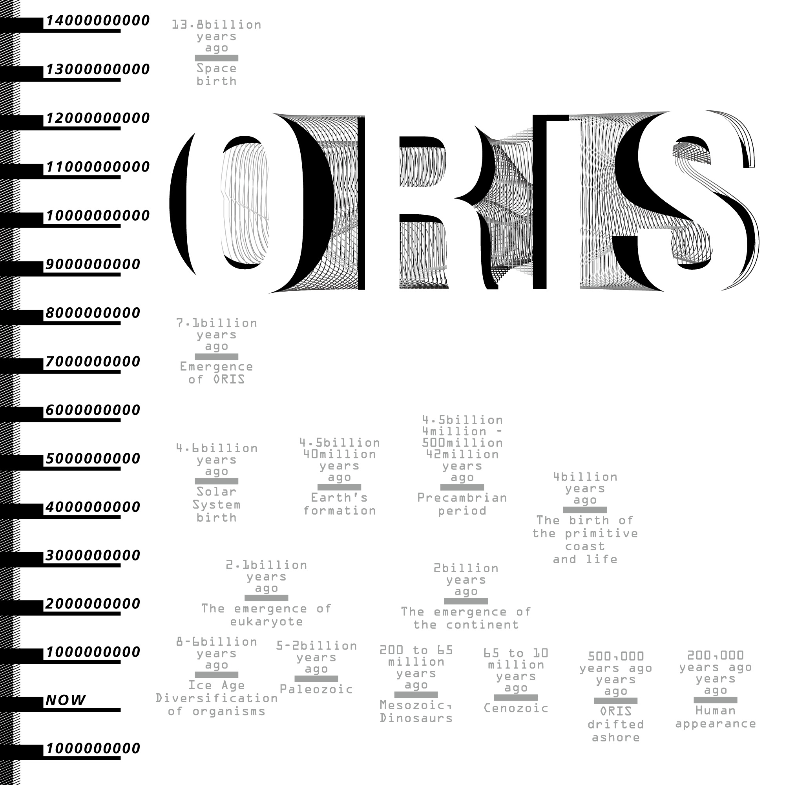

2016年4月26日で5年目を迎えるゆざめレーベルが、これまで”あけたらしろめ“として作家活動を行ってきた草野義朗による新たなプロジェクト「ORIS」とコラボレーションしCD作品としてコンセプト・コンピレーションアルバムのリリースが決定しました。2016年4月24日に行われるM3で頒布開始となります。

 

私は二曲目を担当しています！

[http://yuzame-label.com/news/info/160412.html](http://yuzame-label.com/news/info/160412.html)

「ORIS」 01. 0章：Oris appears / rekanan 02. 1章：Let there be light / in the blue shirt 03. 2章：Divide the Oris from the humans / ginkiha 04. 3章：Dry land appears / AMUNOA 05. 3.5章：Human / アライヨウコ 06. 4章：Two great lights – 神様の渦 – (feat. nicamoq) / Yunomi 07. 5章：Be fruitful, and multiply / SAPPY 08. 5.5章：Death / callasoiled 09. 6章：Let us make man / O2i3 10. 6.5章：Cycle / Stereoman 11. 7章：Heaven (feat. アンテナガール) / Utopians. 12. 7.5章：in a galaxy far, far away / Batsu
