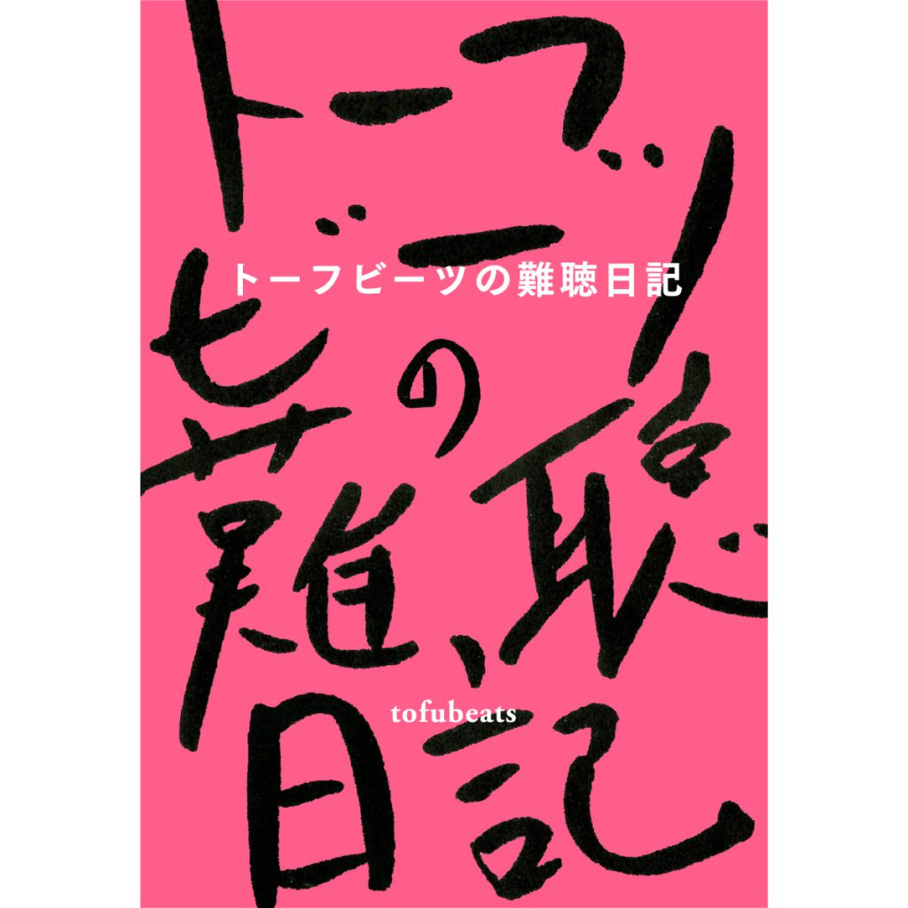

内なるトーフビーツを全て暴き出すトーフビーツ丸出しテキストこと"トーフビーツの難聴日記"にトーフビーツについてガチのマジレスをするトーフビーツコラムを提供させていただきました。2022/5/18発売です。

予約・購入

- BOOKぴあ  
    https://book.pia.co.jp/book/b602114.html
- TOWER RECORDS  
    \*特典「未発表音源 ”Mirror (1st demo 2019)” QRコード付きポストカード」  
    https://tower.jp/item/5384011
- HMV  
    \*特典「未発表音源 ”FLASH” QRコード付きポストカード」  
    https://www.hmv.co.jp/product/detail/12706690
- 1003  
    \*特典「トーフビーツの難聴日記reprise 特典ペーパー」  
    https://1003books.stores.jp/items/625a69143463e756bf84aaf6
- Amazon.co.jp / Kindle  
    https://amzn.to/3qR10cZ
- 楽天 / 楽天Kobo  
    http://books.rakuten.co.jp/rb/17069444/
- honto  
    https://honto.jp/netstore/pd-book\_31684099.html

コラム執筆  
杉生健(CE$)  
伊藤温美(ワーナーミュージック・ジャパン)  
imdkm  
in the blue shirt

音楽プロデューサー／DJのトーフビーツ、初の著書︕  
2018年に患った突発性難聴をきっかけに非公開で書き始めた日記は、当初は次作アルバムのセルフライナーノーツ（＝制作日誌）のつもりで書き溜めていたものだが、気づけばこれまでに30万字を超えるボリュームに。この間、コロナ禍での活動制限、生まれ育った神戶を離れての上京、さらには結婚など、図らずも公私ともに起こったさまざまな出来事が綴られた約３年4ヶ月の記録。それは結果的に、彼の日々の悩みや暮らし、そして仕事や人生の考え方などが記されたエッセイとなった。本書は待望のアルバム「REFLECTION」と同日発売。

編集 和久田善彦  
ブックデザイン 小山直基
