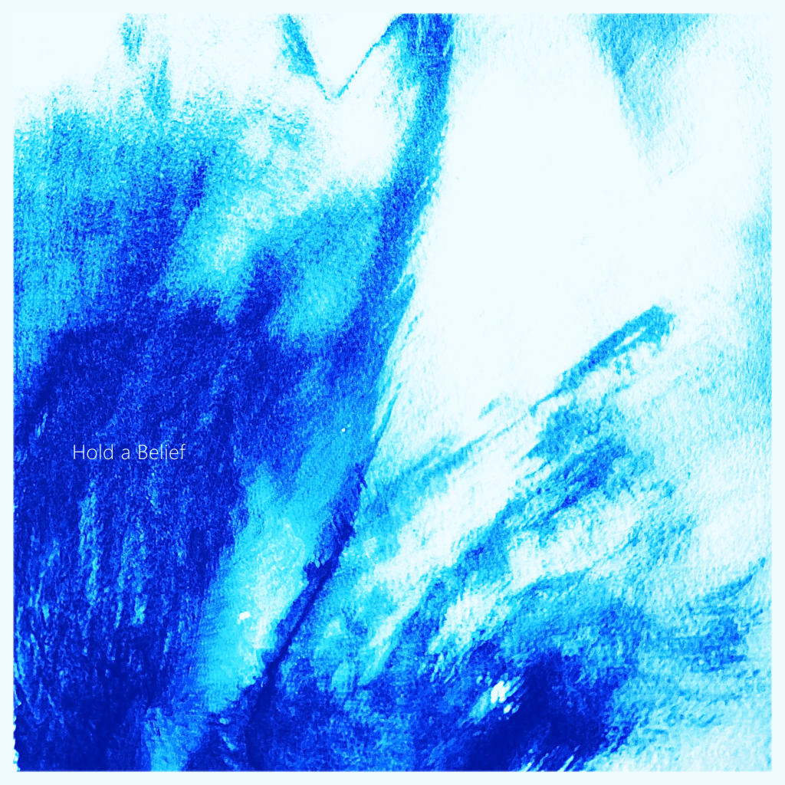

<figure>

<figcaption>

今夏リリース予定のin the blue shirt 3rdアルバム"Park with a Pond"より先行シングル"Hold a Belief"をリリースしました。アートワークは天才hyper thanks bomb（[@hyperthanksbomb](https://twitter.com/hyperthanksbomb)）氏で、楽曲中バイオリン演奏は日本有数のプレイヤーである町田匡さん（[@machidatadashi](https://twitter.com/machidatadashi)）です。何卒！

</figcaption>

</figure>

<iframe width="100%" height="52" src="https://odesli.co/embed/?url=https%3A%2F%2Fsong.link%2Fi%2F1628588122&amp;theme=light" frameborder="0" allowfullscreen sandbox="allow-same-origin allow-scripts allow-presentation allow-popups allow-popups-to-escape-sandbox" allow="clipboard-read; clipboard-write"></iframe>

<iframe style="border: 0; width: 350px; height: 442px;" src="https://bandcamp.com/EmbeddedPlayer/track=1941597356/size=large/bgcol=ffffff/linkcol=0687f5/tracklist=false/transparent=true/" seamless=""><a href="https://intheblueshirt.bandcamp.com/track/hold-a-belief">Hold a Belief by in the blue shirt</a></iframe>
