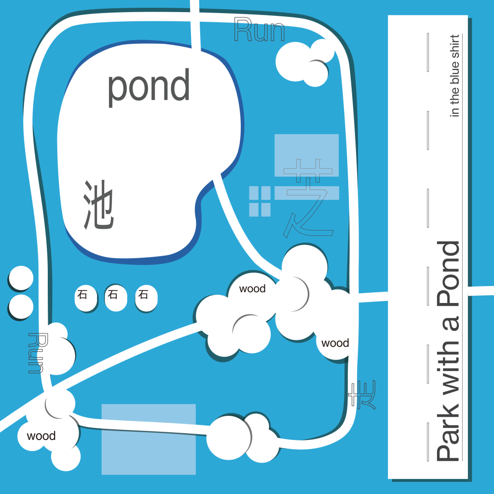

2020年に発売したEP「in my own way e.p.」から2年空いてしまいましたが、3rdアルバム"Park with a Pond" がようやくリリースされます。2022年8月26日より各種サブスクリプションサービスにて配信開始。楽曲制作&ミックス及びマスタリングは有村単機、9.Hold a Beliefのバイオリン演奏は日本指折りのプレイヤーである町田匡さんにご担当いただきました。アートワークは[伊藤猛](https://twitter.com/take_sheet)氏によるものです。  
  
リリースに先立ってごちゃごちゃシングル出しましたがこれにてひと段落です。CDやレコードも作っとくのでどうにかこうにかよろしくお願いいたします。  
  
in the blue shirt 3rd album "Park with a Pond"  
1\. Concentration and Distraction  
2\. Intersection of Sets  
3\. Park With A Pond  
4\. At Heart  
5\. As a Fake  
6\. Stroll down  
7\. Time to Go  
8\. Fidgety  
9\. Forward Thinking  
10\. Hold a Belief  
11\. Vision of Mind  
12\. Be What I am

https://youtu.be/WDAKh0LvXu8
